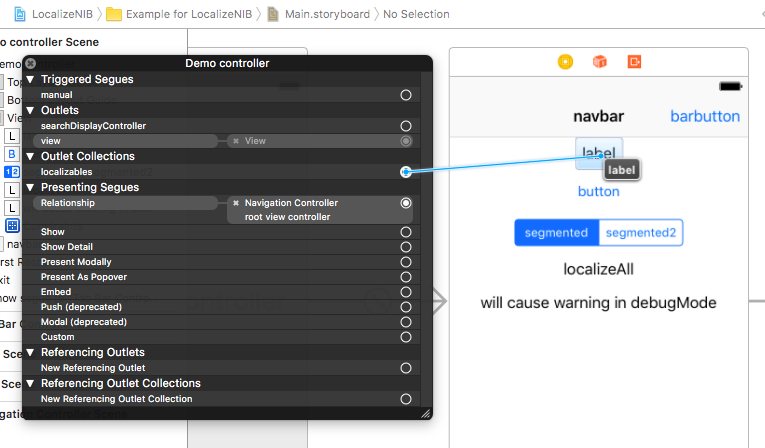

# LocalizeNIB

[](http://cocoapods.org/pods/LocalizeNIB)
[](http://cocoapods.org/pods/LocalizeNIB)
[](http://cocoapods.org/pods/LocalizeNIB)
[](https://dashboard.buddybuild.com/apps/591db4f53fe52600015f1bd9/build/latest?branch=master)

LocalizeNIB helps you with localizing storyboards and XIB files. Put everything you want to be localized to `localizables`
outlet collection in your `UIViewController` and LocalizeNIB will use `NSLocalizedString` on everything. No more messing with unreadable
component IDs!

## Installation

LocalizeNIB is available through [CocoaPods](http://cocoapods.org). To install
it, simply add the following line to your Podfile:

```ruby
pod "LocalizeNIB"
```

## Usage

### Basic usage

LocalizeNIB uses `NSLocalizedString` by default. If you have your Localizable.strings file ready, then all you need to do is add all components you want to localize to `localizables` outlet collection (as seen on the picture below). LocalizeNIB will use string values set in storyboard as a key for localization. There are extensions for common UIKit components so you don't need to use custom classes if you don't want to.



### String extension

If you want to localize `String` objects in the same way as you UI objects, you can use `String.localized` property. This property uses same shared instance and `LocalizedStringProvider`.

```swift
"localize me!".localized
```

### Debug mode

Setting `localizeNIB.debugMode` to true will enable debug mode. LocalizeNIB will log unknown string keys and objects that either failed localization or do not support localization at all. Logging unknown keys works only with default string provider.

If you use your own logging solution you can integrate it with LocalizeNIB by providing `localizeNIB.debugBlock`.

### Customizing localized strings

You can set `localizeNIB.stringProvider` block and provide custom localized strings. This block will be called quite a lot, so it should return quickly.

Following example takes all passed-in keys and simply returns their uppercased version.

```swift
localizeNIB.stringProvider = { $0.uppercased() }
```

### Localizing custom components

You can provide custom localization to any object by implementing `Localizable` protocol. Extensions for UIKit classes are provided by default.

```swift
extension UILabel: Localizable {
    open func localize(provider: LocalizedStringProvider) throws {
        text = text.flatMap { provider($0) }
    }
}
```

### Catch-all block

You can customize localization process or exclude some objects from localization by providing `localizeNIB.localizeAll` block. This block is called for every object being localized. You can skip localization for this object if you return true in this block.

Following example takes all `UILabel` components with `localizeAll` text, provides custom text for it.

```swift
localizeNIB.localizeAll = { object, stringProvider in
    if let label = object as? UILabel, label.text == "localizeAll" {
        label.text = "Caught by localizeAll block"
        return true                
    } else {
        print("About to localize \(object)")
        return false
    }
}
```

### Using LocalizeNIB with MainInterface

When customizing behaviour of LocalizeNIB and using default storyboard, you must do all customization in the init method of your `UIApplicationDelegate` otherwise the storyboard will be localized before your customizations. See [AppDelegate in example project](Example/LocalizeNIB/AppDelegate.swift) for reference.

### localizeNIB global variable

`localizeNIB` global variable is simply a shortcut for `LocalizeNIB.instance` and references the same object. If you do not like global variables, you can simply use `LocalizableNIB.instance`.

## Example

To run the example project, clone the repo, and run `pod install` from the Example directory first.

## Author

Jindra Dolezy, jindra.dolezy@strv.com

## License

LocalizeNIB is available under the MIT license. See the LICENSE file for more info.
